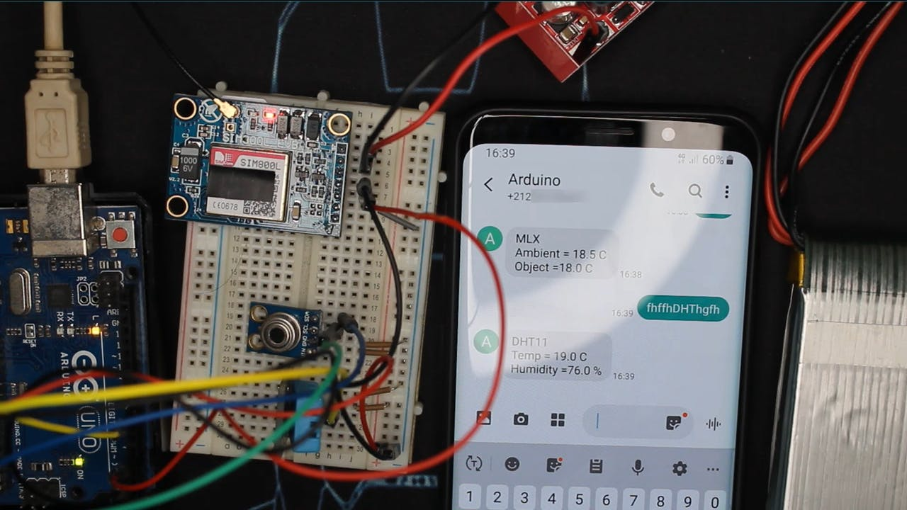

<div align=center>

</div>

# arduino-serial-lib-with-Gsm-sim800l
 A basic implementation of arduino serial communication with gsm-sim800l <br>
 Note: No external libraries are required, its very simple but eloquent.

## Description
This is my idea of what serial communication with gsm-sim800l could look like. <br>
There are all sorts of different libraries for different gsm-sim800l modules. <br>
I have included simple code for sending and reading sms, making phone call and making
http request with the arduino and the sim800l. <br> 

This particular implementation assumes the device is installed in an actual tollbooth <br>
where the device updates the main office if someone tampers with the device <br>
It also reports to the main office in case the main power in the area goes off <br>
It also opens and closes the barrier for the tollbooth to allow the vehicles to pass <br>
after the driver pays the toll.

## Setup
To build this project you need the following:
* Arduino IDE
* Arduino Uno
* GSM-SIM800L module
* Hook-up wires
* Some basic soldering skills
* 9v battery
* SimCard with both call time and 3G data bundle
```bash
  IF you are living in Accra, Ghana you can purchase your supplies here geekselectronics[!(https://geekelectronics.io/)]
  ````